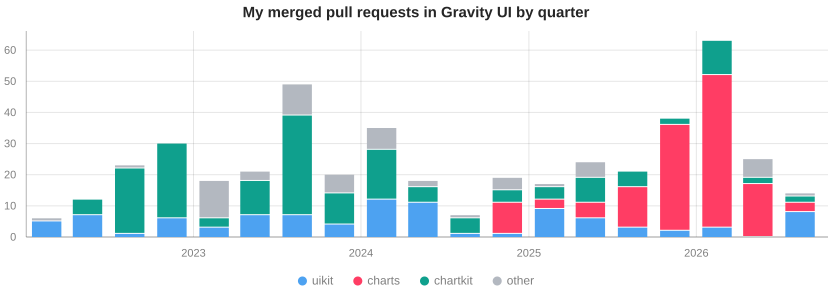

### Hi 👋, I'm Evgenii Alaev

I'm a frontend developer on the [DataLens](https://datalens.tech/) team and a core contributor to [Gravity UI](https://gravity-ui.com/) — mostly to its component library and its charts.

- 🧩 **[@gravity-ui/uikit](https://github.com/gravity-ui/uikit)** — core contributor and reviewer of the base React component library 
    
- 📊 **[@gravity-ui/charts](https://github.com/gravity-ui/charts)** — core contributor to the React charting library · [docs](https://gravity-ui.github.io/charts/) · [playground](https://korvin89.github.io/charts-playground/) 
    

I also contribute to [chartkit](https://github.com/gravity-ui/chartkit), [dashkit](https://github.com/gravity-ui/dashkit), [date-utils](https://github.com/gravity-ui/date-utils) and other Gravity UI packages.

----

<picture>
  <source media="(prefers-color-scheme: dark)" srcset="assets/merged-prs-dark.svg">
  
</picture>

<picture>
  <source media="(prefers-color-scheme: dark)" srcset="assets/authored-vs-reviewed-dark.svg">
  
</picture>
<picture>
  <source media="(prefers-color-scheme: dark)" srcset="assets/npm-downloads-dark.svg">
  
</picture>

The charts are drawn with [@gravity-ui/charts](https://github.com/gravity-ui/charts) and refreshed weekly by a [GitHub Action](.github/workflows/update-charts.yml).
