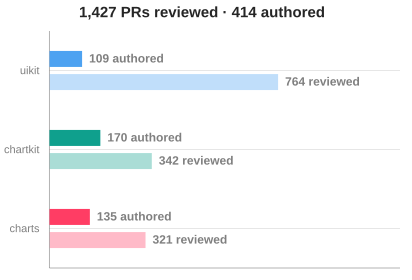
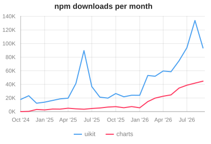

### Hi 👋, I'm Evgenii Alaev

I'm a frontend engineer on the [DataLens](https://datalens.tech/) team. I wrote the charting libraries of [Gravity UI](https://gravity-ui.com/) and help maintain its component library.

- **[@gravity-ui/uikit](https://github.com/gravity-ui/uikit)** — core contributor and reviewer of the base React component library
- **[@gravity-ui/charts](https://github.com/gravity-ui/charts)** — author of the React charting library that replaced Highcharts in DataLens · [docs](https://gravity-ui.github.io/charts/) · [playground](https://korvin89.github.io/charts-playground/)
- **[@gravity-ui/chartkit](https://github.com/gravity-ui/chartkit)** — author of the plugin-based React component that renders charts from multiple charting libraries

----

<picture>
  <source media="(prefers-color-scheme: dark)" srcset="assets/authored-vs-reviewed-dark.svg">
  
</picture>
<picture>
  <source media="(prefers-color-scheme: dark)" srcset="assets/npm-downloads-dark.svg">
  
</picture>

The charts are drawn with [@gravity-ui/charts](https://github.com/gravity-ui/charts) and refreshed weekly by a [GitHub Action](.github/workflows/update-charts.yml).
